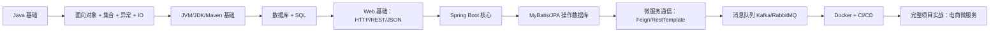

**Java 及其现代开发生态（含 Spring Boot、微服务、DevOps 等）的 learning-route**

---

# 📚 Java 与现代 Web 开发生态学习指南（CS 大学生版）

> **目标**：掌握 Java 后端开发核心技术栈，能独立开发并部署一个电商微服务系统。  
> **适用人群**：计算机专业本科生（大二~大三）  
> **核心关键词**：Java、Spring Boot、Maven、JVM、Docker、微服务、Kafka、CI/CD

---

## 🧭 一、整体学习路线图



### ⏱️ 建议时间安排
- **大二下学期**：完成 A–E（打牢基础）
- **大三上学期**：完成 F–H（做小型项目）
- **大三下学期**：完成 I–K（做出可展示的微服务项目，用于简历/实习）

---

## 📖 二、分阶段学习资源（全部免费或学生友好）

### ✅ 阶段 1：Java 基础 + 工具链（1–2 个月）

| 主题 | 推荐资源 | 实践任务 |
|------|--------|--------|
| **Java 语法 & 面向对象** | - [廖雪峰 Java 教程](https://www.liaoxuefeng.com/wiki/1250000807362048)<br>- 《Head First Java》（O'Reilly，图书馆可借） | 写一个“图书管理系统”控制台程序（用 `List<Book>` 存储，支持增删查） |
| **JDK / JRE / JVM 概念** | - [JVM 简明图解（知乎）](https://zhuanlan.zhihu.com/p/360003386)<br>- Oracle 官方 [Java Platform Overview](https://docs.oracle.com/javase/8/docs/) | 用 `java -version` 和 `javac -version` 验证 JDK 安装 |
| **Maven 入门** | - [Maven 官方入门指南](https://maven.apache.org/guides/getting-started/)<br>- B站：【Maven 零基础入门】 | 用 Maven 创建项目，引入 `junit` 依赖并写一个单元测试 |
| **开发环境** | - JDK 17（推荐 [OpenJDK](https://adoptium.net/)）<br>- IDE：[IntelliJ IDEA Community](https://www.jetbrains.com/idea/download/)（免费）<br>- Git + GitHub（必须掌握） | 配置好本地开发环境，提交第一个 Java 项目到 GitHub |

---

### ✅ 阶段 2：Web 开发基础 + Spring Boot（2–3 个月）

| 主题 | 推荐资源 | 实践任务 |
|------|--------|--------|
| **HTTP / REST / JSON** | - [MDN HTTP 概述](https://developer.mozilla.org/zh-CN/docs/Web/HTTP/Overview)<br>- 使用 [Postman](https://www.postman.com/) 测试 API | 手动用 curl 或 Postman 发送 GET/POST 请求 |
| **Spring Boot 入门** | - [Spring 官方：Building a RESTful Web Service](https://spring.io/guides/gs/rest-service/)<br>- B站：【狂神说Java】SpringBoot 最新教程 | 实现一个 `/hello?name=xxx` 接口，返回 `"Hello, xxx!"` |
| **MySQL + SQL** | - 安装 MySQL 或使用 [Docker 运行 MySQL](https://hub.docker.com/_/mysql)<br>- [SQLBolt 交互练习](https://sqlbolt.com/) | 创建 `users` 表，实现注册/登录的 SQL 语句 |
| **Spring Data JPA / MyBatis** | - Spring Data JPA：[官方文档](https://spring.io/projects/spring-data-jpa)<br>- MyBatis：[中文文档](https://mybatis.org/mybatis-3/zh/index.html) | 用 JPA 或 MyBatis 实现用户信息的增删改查 |

> 💡 **阶段项目**：Todo List API（支持创建、查询、删除待办事项，数据持久化到 MySQL）

---

### ✅ 阶段 3：微服务进阶（2–3 个月）

| 主题 | 推荐资源 | 实践任务 |
|------|--------|--------|
| **服务拆分与通信** | - RestTemplate / OpenFeign<br>- [Spring Cloud OpenFeign 文档](https://docs.spring.io/spring-cloud-openfeign/docs/current/reference/html/) | 拆分 Todo 为 `user-service` 和 `todo-service`，通过 Feign 调用 |
| **服务注册与发现** | - [Nacos 快速开始](https://nacos.io/zh-cn/docs/quick-start.html)<br>- Spring Cloud Alibaba 示例 | 用 Nacos 作为注册中心，自动发现服务 |
| **消息队列（Kafka）** | - B站：【尚硅谷 Kafka 教程】<br>- [Kafka 入门（极客时间试读）](https://time.geekbang.org/column/intro/100029201) | 用户注册后，发送消息到 Kafka，由另一个服务打印日志 |
| **API 网关（可选）** | - Spring Cloud Gateway<br>- [官方示例](https://spring.io/projects/spring-cloud-gateway) | 通过网关统一访问 `/api/user/**` 和 `/api/todo/**` |

---

### ✅ 阶段 4：DevOps 与部署（1–2 个月）

| 主题 | 推荐资源 | 实践任务 |
|------|--------|--------|
| **Docker** | - [Docker — 从入门到实践（开源书）](https://yeasy.gitbook.io/docker_practice/)<br>- B站：【编程不良人 Docker 教程】 | 编写 `Dockerfile` 打包 Spring Boot 应用 |
| **Docker Compose** | - [官方 Compose 文件参考](https://docs.docker.com/compose/compose-file/) | 用 `docker-compose.yml` 同时启动 MySQL + Spring Boot |
| **CI/CD（GitHub Actions）** | - [GitHub Actions 官方教程](https://docs.github.com/zh/actions)<br>- 示例：自动构建并推送 Docker 镜像 | 提交代码后，自动运行测试并构建镜像 |
| **Linux 基础** | - 腾讯云/阿里云学生服务器（约 ¥10/月）<br>- 学习命令：`ssh`, `ls`, `ps`, `top`, `vim` | 在云服务器上部署你的 Docker 应用 |

---

### ✅ 阶段 5：完整项目实战 —— 电商微服务系统

#### 🎯 功能模块（简化版）
1. **用户服务**：注册、登录（JWT 认证）
2. **商品服务**：商品列表、详情（分页）
3. **订单服务**：创建订单（校验库存）
4. **消息队列**：下单成功 → 发送 Kafka 消息
5. **服务治理**：Nacos 注册中心 + 配置中心
6. **部署**：Docker Compose 一键启动

#### 🔗 推荐开源项目参考
- [mall](https://github.com/macrozheng/mall)：功能完整的电商系统（含前台+后台）
- [spring-cloud-alibaba-examples](https://github.com/alibaba/spring-cloud-alibaba/tree/master/spring-cloud-alibaba-examples)
- [jeecg-boot](https://github.com/jeecgboot/jeecg-boot)：低代码快速开发平台

#### 📦 交付物建议
- GitHub 仓库（含清晰 README、架构图、启动说明）
- 演示视频（2 分钟内）
- 技术博客（发布在掘金/CSDN/个人博客）

---

## 💡 三、给 CS 大学生的特别建议

### ✅ 学习原则
- **动手 > 看视频**：每个知识点都要写代码验证。
- **小步快跑**：先跑通最小功能，再逐步扩展。
- **善用 Git**：每天 commit，养成版本管理习惯。

### ✅ 利用学校资源
- 课程设计/毕业设计选“微服务”方向
- 申请实验室服务器练 Docker/K8s
- 组队参加“中国大学生计算机设计大赛”、“软件杯”等

### ✅ 构建作品集
> 一个完整的 GitHub 项目 > 100 道 LeetCode（初期）。面试官更关心你**能否交付工程**。

### ✅ 社区与持续学习
- 关注：Spring Blog、InfoQ、掘金 Java 专栏
- 尝试给开源项目提 PR（哪怕只是修 typo）

---

## 🚀 四、行动清单（今天就能做）

1. [ ] 安装 **JDK 17**（OpenJDK）
2. [ ] 安装 **IntelliJ IDEA Community**
3. [ ] 创建 GitHub 账号
4. [ ] 跑通第一个 Spring Boot 项目：
   ```java
   @RestController
   public class HelloController {
       @GetMapping("/hello")
       public String hello() {
           return "Hello, Java World!";
       }
   }
   ```
5. [ ] 提交到 GitHub，命名为 `java-learning-journey`

---

> **记住**：你不需要一次学会所有东西。只要每天进步一点点，半年后你会感谢现在的自己。

---

✅ **最后提示**：此笔记可长期维护。每完成一个阶段，就在对应位置打勾 ✅，并补充自己的心得！

--- 

> 📌 **作者备注**：本笔记基于 2025 年主流技术栈整理，适用于国内大厂/外企后端岗位准备。技术会演进，但工程思维永恒。

---
