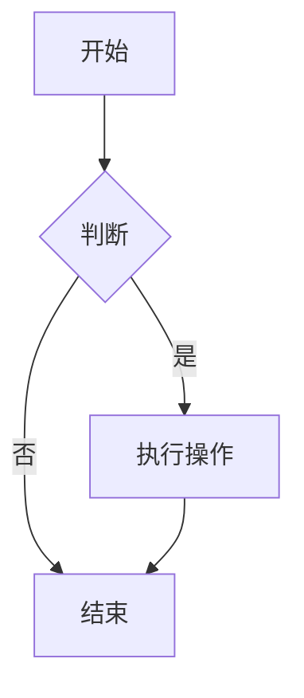
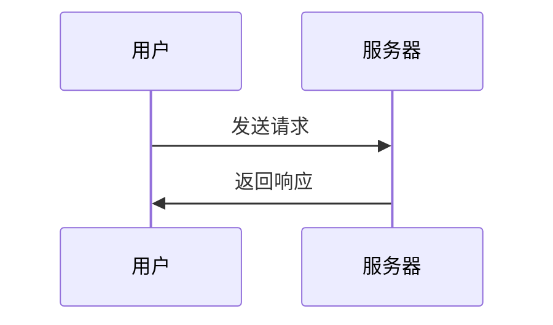

---
title: md手册
data: 2025-10-28
tags: 
  - note
categories: 未分类
---
使用ai生成的hexo写blog常用markdown语法。

1. 基础Markdown语法

标题

# 一级标题
## 二级标题
### 三级标题
#### 四级标题
##### 五级标题
###### 六级标题


文本格式

**粗体文本**
*斜体文本*
***粗斜体***
~~删除线~~
`行内代码`
==高亮文本== (部分主题支持)


列表

## 无序列表
- 项目1
- 项目2
  - 子项目1
  - 子项目2

## 有序列表
1. 第一项
2. 第二项
   1. 子项1
   2. 子项2

## 任务列表
- [x] 已完成任务
- [ ] 待办任务


链接和图片

[文字链接](https://example.com)
[相对链接](../other-note.md)


引用块

> 这是引用内容
> 
> 多行引用
> 第二行

> 嵌套引用
>> 二级引用


代码块

```javascript
// JavaScript代码
function hello() {
  console.log("Hello, World!");
}
```

```python
# Python代码
def hello():
    print("Hello, World!")
```

```bash
# 命令行代码
hexo new post "我的文章"
```


2. Hexo特有的Front-matter

每个Markdown文件开头的YAML配置区域：
---
title: 我的笔记标题
date: 2024-01-15 14:30:00
updated: 2024-01-16 10:00:00
tags: [Markdown, Hexo, 笔记]
categories: [技术, 学习]
toc: true
mathjax: true
comments: true
cover: /images/cover.jpg
description: 这是文章的简短描述
---


常用Front-matter字段

字段 说明 示例

title 文章标题 title: JavaScript学习笔记

date 创建时间 date: 2024-01-15 14:30:00

updated 更新时间 updated: 2024-01-16 10:00:00

tags 标签 tags: [前端, JavaScript]

categories 分类 categories: [技术, 编程]

toc 显示目录 toc: true

mathjax 数学公式 mathjax: true

cover 封面图片 cover: /images/cover.jpg

3. Hexo标签插件（Tag Plugins）

笔记提醒块


这是信息提示



警告内容



危险提示



成功提示



代码块增强


function test() {
  return "Hello";
}



import math
result = math.sqrt(16)
print(result)  # 输出 4.0



引用外部内容






引用文本内容...



图片和相册









4. 数学公式（需要主题支持）

行内公式

勾股定理：$a^2 + b^2 = c^2$


块级公式

$$
\begin{aligned}
f(x) &= \int_{-\infty}^\infty \hat f(\xi)\,e^{2 \pi i \xi x} \,d\xi \\
&= \frac{1}{\sqrt{2\pi}} \int_{-\infty}^\infty \hat f(\omega) e^{i\omega x} \,d\omega
\end{aligned}
$$


5. 表格语法

| 语法 | 说明 | 示例 |
|------|------|------|
| 标题 | 单元格 | 内容 |
| 粗体 | **粗体** | `**文本**` |
| 代码 | `代码` | 行内代码 |
| 左对齐 | 居中对齐 | 右对齐 |
|:-------|:--------:|-------:|
| 左对齐内容 | 居中内容 | 右对齐内容 |
| 数据1 | 数据2 | 数据3 |


6. 流程图和图表（部分主题支持）

Mermaid流程图




序列图




7. 实际笔记示例

---
title: JavaScript闭包学习笔记
date: 2024-01-15 10:00:00
updated: 2024-01-16 14:30:00
tags: [JavaScript, 闭包, 前端]
categories: [编程, 前端开发]
toc: true
mathjax: false
---

## 什么是闭包？

闭包是指**能够访问其他函数作用域中变量的函数**。

## 基本语法


function outer() {
    let count = 0;  // 外部函数变量
    
    function inner() {  // 闭包函数
        count++;
        console.log(count);
    }
    
    return inner;
}

const counter = outer();
counter(); // 输出 1
counter(); // 输出 2


## 关键特性

- ✅ 保持对外部变量的引用
- ✅ 实现数据私有化
- ⚠️ 可能引起内存泄漏


注意：过度使用闭包可能导致内存问题！


## 实际应用场景

### 1. 计数器实现
javascript
function createCounter() {
    let count = 0;
    return {
        increment: function() { count++; },
        getCount: function() { return count; }
    };
}


### 2. 模块模式
javascript
const myModule = (function() {
    let privateVar = 0;
    
    return {
        publicMethod: function() {
            return privateVar;
        }
    };
})();


## 总结表格

| 优点 | 缺点 |
|------|------|
| 数据封装 | 内存占用 |
| 实现私有变量 | 调试困难 |
| 灵活性强 | 性能影响 |

> **学习建议**：理解闭包的关键在于掌握作用域链的概念。


8. 实用技巧

文件组织建议


notes/
├── programming/          # 编程笔记
│   ├── javascript.md    # JavaScript笔记
│   ├── python.md        # Python笔记
│   └── algorithm.md     # 算法笔记
├── study/               # 学习笔记
│   └── math.md         # 数学笔记
└── index.md            # 笔记首页


快速模板

创建scaffolds/note.md模板：
---
title: {{ title }}
date: {{ date }}
tags: []
categories: []
toc: true
---

## 概述

## 详细内容

## 总结


这样您就可以用 hexo new note "笔记标题" 快速创建笔记了！